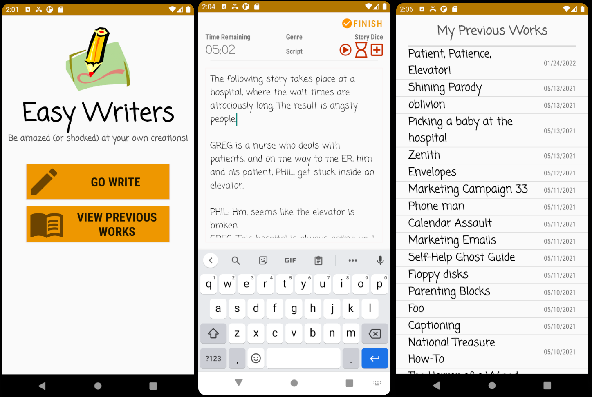

# Easy Writers

    

## About
This Android app was created for a final project assignment in CIS 4270 - Android Programming at Cal Poly Pomona. It's based on the process of **freewriting**, which is where you write whatever comes to your mind without stopping for a short period of time. It's also partly inspired by Rory's Story Cubes, a toy which encourages story telling through the use of story cubes.

## Features
- Uses [Android-compatible FontAwesome icons](https://github.com/diwanoczko/fa5ad-free
) (thanks to Dariusz Iwanoczko) to provide hundreds of possible dice combinations for story ideas.
- Saves all user freewrites on a local database where the user can view their previous entries.

## Design
Follows standard Android MVC pattern. 

## Running the Project 
Clone the repository, open it in Android Studio, and then just hit 'run' in order to install the app on the emulator.
